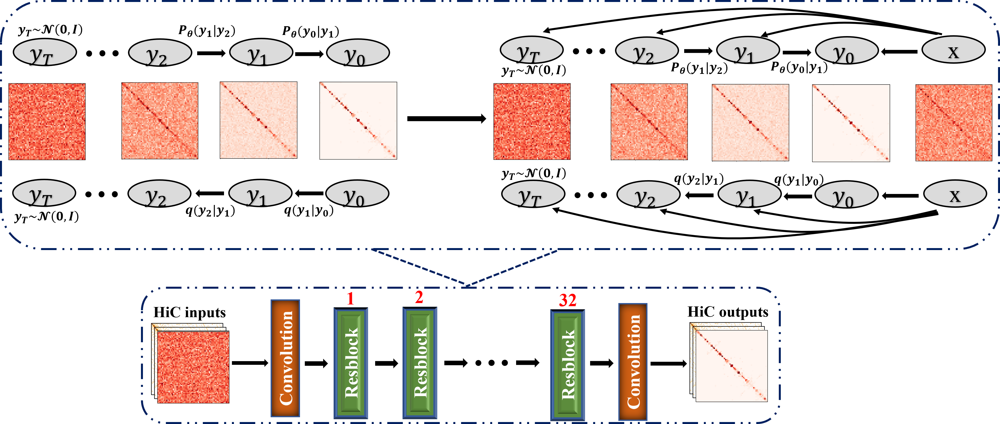

<div align="center">

# HiCDiff
Diffusion models for denoising Hi-C chromosome conformation capturing data



</div>

## Description
The directory contains the code used to run the experiments and our own models for the paper
## Developer

```
Yanli Wang
Deparment of Computer Science
University of Missouri
Columbia, MO 65211, USA
Email: yw7bh@missouri.edu
```
## Contact

```
Jianlin (Jack) Cheng, PhD
William and Nancy Thompson Distinguished Professor
Department of Electrical Engineering and Computer Science
University of Missouri
Columbia, MO 65211, USA
Email: chengji@missouri.edu
```
## HiC dataset used in the paper

```
The Cooler file dataset for Human cells with GEO number GSE130711 can be get from https://salkinstitute.app.box.com/s/fp63a4j36m5k255dhje3zcj5kfuzkyj1 or more detailed Human single-cell data at https://salkinstitute.app.box.com/s/fp63a4j36m5k255dhje3zcj5kfuzkyj1/folder/82405563291
The Cooler file format dataset for Drosophila was obtained from GEO with code GSE131811 can be get from https://www.ncbi.nlm.nih.gov/geo/query/acc.cgi?acc=GSE131811 
```
## Dependencies

HiCDiff is written in Python3 and uses the Pytorch module. 
The dependencies can be installed by the following command:

```bash
# create conda environment
conda env create -f HiCDiff.yml

# active the environment
conda active HiCDiff
```
## Preparing datasets
```bash
# First step create folder for the datasets, the 'Datasets' folder should be at the same level as 'TrainingYourData' Folder 
mkdir -p Datasets/Human
# or
mkdir -p Datasets/Drosophila 

# Second download the dataset to Datasets/Human or Datasets/Drosophila the by the given link

# Third check the download files' extension, if not .mcool extension, you should zoomify the files to get the resolution you want
cooler zoomify --balance filename.cool

# Fourth name the zoomified file to the customized name as bellow
mv fiilename.mcool cell1_name.mcool
# note: you can replace the numerical number as any interger you want, and change the 'name' as you want.
```
## Running HiCDiff

If you want to retrain your dataset, YOU can run HiCDiff by the following command:

```bash
# First step check the envirment whetther it is active, if not active the envirment 
conda activate HiCDiff.yml

# Second step run the training scripts
python train.py -u [boolean_value] -e [epoch_number] -b [batch_size] -n [cell_number] -l [cell_line] -s [sigma]
```
## Optional Parameters:

```bash
-u, --unspervised    # set the model you want to use, '1' means gan that you will use unsupervsed way to train your model, '0' indicates you will use supervised way to train your model.
-e, --epoch          # How many epoches that you want to train.
-b, --batch_size     # The batch size you want to use in you model.
-n, --celln          # Cell number in the dataset you want to feed in you model.
-l, --celline        # Which cell line you want to choose for your dataset, default is 'Human', you should choose one name in ['Human', 'Dros']
-s, --sigma          # The Gaussian noise level for the raw dataset, it should be equal or larger than 0.0 but not larger than 1.0, '1.0' means the largest noise added to datasets. 
```
## License
This project is covered under the MIT License.

## Reference
Yanli Wang, & Jianlin Cheng. HiCDiff: Hi-C denoising with improved diffusion model. (to be Submitted).